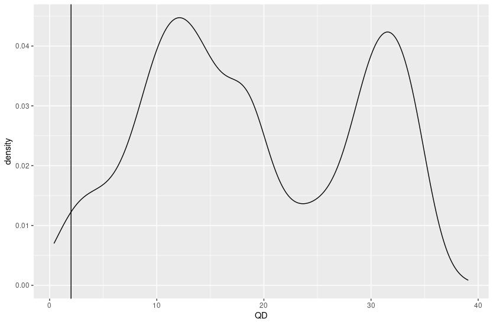
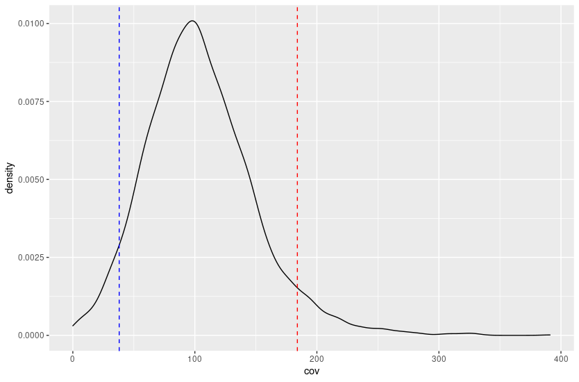
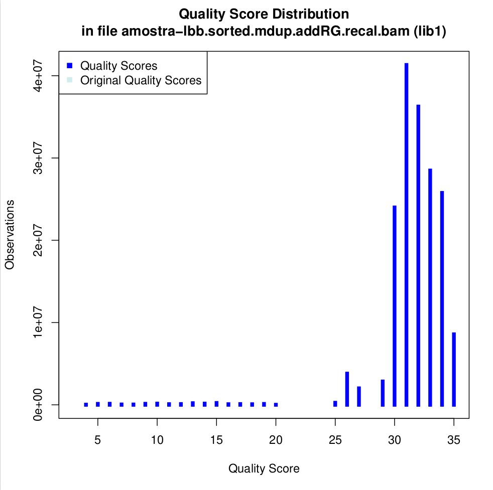

# Dia 2 - Respostas Controle de Qualidade

1. Quais variantes deverão ser desconsideradas no seu VCF? - Qualquer métrica do software de escolha poderá ser utilizada. Discorra sobre a métrica utilizada.

Primeiramente, as variantes identificadas fora das regiões exônicas, não devem ser consideradas, pois a metodologia de sequenciamento usada foi WES (whole exome sequencing). Dessa forma, excluímos do VCF todos polimorfismos detectadas fora dos exons, isso foi realizado utilizando a ferramenta `vcftools`. Outro ponto importante a observar são as métricas calculadas pelos algoritmos de chamada de variantes. Ao gerar o VCF, o `HaplotypeCaller`, da suíte `gatk`, foi usado para chamada das variantes. Esse algoritmo produz diversas métricas interessantes que analisam o contexto das variantes, entre elas o `QUAL` (mensura o grau de confiança da variante potencial) e `DP` (cobertura do loci da variante). Apesar de `QUAL` trazer um score para confiança da variante, ele é extremamente inflado em regiões de alta cobertura. Portanto, a opção da métrica `QD` (QualByDepth) é uma versão "normalizada" de `QUAL`. O filtro `QD < 2.0` foi usado para excluir as variantes anotadas com QualByDepth menor que dois, abaixo plotamos a densidade de `QD` com a linha vertical no valor de QD=2. O pequeno morro à extrema esquerda representa potenciais variantes falso positivas.

2. Discorra sobre as regiões com baixa cobertura e quais foram seus critérios. Figuras são bem-vindas.

A média de cobertura das regiões exônicas é cerca de 100x como podemos visualizar no seguinte gráfico. Ao analisar o gráfico é possível observar regiões com inúmeras reads mapeadas e regiões com poucas reads.

Para determinar o threshold e, consequentemente, os filtros para classificar regiões como sendo de baixa cobertura usou-se a observação dos quantis de 2,5% (linha vertical em azul do gráfico) e para regiões de alta cobertura o quartil de 97,5% (linha vertical em vermelho). Portanto, as regiões com cobertura abaixo do valor do quartil de 2,5%, ou seja, de cerca de 30x foram considerdas de baixa cobertura.

3. Obter informações sobre seu alinhamento. Quantos reads? Qual a porcentagem deles que foi mapeada corretamente? Muitos alinharam em mais de um local do genoma com a mesma qualidade?

O arquivo BAM contêm 1.734.246 reads, sendo 1.505.766 (86,83%) dessas reads mapeadas nas regiões exônicas com 1.506.676 (86,76%) com o par mapeado corretamente. As reads mapeadas dentro das regiões exônicas apresentaram média de 57,40 de qualidade de mapeamento (mapq).

Resultados

- Para a questão 1 deverá ser enviado o VCF pós-filtragem = `amostra-lbb.filtered.recode.vcf`

- Para a questão 2 deverá ser enviado um BED, contendo as regiões não cobertas = `amostra-lbb.regions.LowDP30.bed`

- Para a terceira questão deverá ser enviado um arquivo TSV, com as colunas "nreads" (número de reads usados), "proper_pairs" (pares mapeados corretamente), "mapQ_0" (número de reads com qualidade de mapeamento == 0) = `metrics_mapping.tsv`
